# Go Agent 开发完整指南

> 基于 Python 教程 `learn-claude-code` 的 Go 语言重新实现，覆盖从最小 Agent 循环到多 Agent 平台的完整链路。
> 4 阶段 19 步，96 个 Go 源文件，约 12,400 行代码。

---

## 目录

- [总体架构概览](#总体架构概览)
- [阶段 1：核心 Agent 引擎（s01-s06）](#阶段-1核心-agent-引擎s01-s06)
  - [s01 — Agent Loop（Agent 循环）](#s01--agent-loopagent-循环)
  - [s02 — Tool Use（工具系统）](#s02--tool-use工具系统)
  - [s03 — Planning（会话级计划）](#s03--planning会话级计划)
  - [s04 — Subagent（子 Agent）](#s04--subagent子-agent)
  - [s05 — Skill Loading（技能加载）](#s05--skill-loading技能加载)
  - [s06 — Context Compaction（上下文压缩）](#s06--context-compaction上下文压缩)
- [阶段 2：生产加固（s07-s11）](#阶段-2生产加固s07-s11)
  - [s07 — Permission System（权限系统）](#s07--permission-system权限系统)
  - [s08 — Hook System（钩子系统）](#s08--hook-system钩子系统)
  - [s09 — Memory System（记忆系统）](#s09--memory-system记忆系统)
  - [s10 — System Prompt（系统提示工程）](#s10--system-prompt系统提示工程)
  - [s11 — Error Recovery（错误恢复）](#s11--error-recovery错误恢复)
- [阶段 3：工作持久化与后台执行（s12-s14）](#阶段-3工作持久化与后台执行s12-s14)
  - [s12 — Task System（持久任务系统）](#s12--task-system持久任务系统)
  - [s13 — Background Tasks（后台任务）](#s13--background-tasks后台任务)
  - [s14 — Cron Scheduler（定时调度）](#s14--cron-scheduler定时调度)
- [阶段 4：多 Agent 平台与外部集成（s15-s19）](#阶段-4多-agent-平台与外部集成s15-s19)
  - [s15 — Agent Teams（Agent 团队）](#s15--agent-teamsagent-团队)
  - [s16 — Team Protocols（团队协议）](#s16--team-protocols团队协议)
  - [s17 — Autonomous Agents（自主 Agent）](#s17--autonomous-agents自主-agent)
  - [s18 — Worktree Isolation（工作树隔离）](#s18--worktree-isolation工作树隔离)
  - [s19 — MCP & Plugin（外部工具集成）](#s19--mcp--plugin外部工具集成)
- [核心抽象与公共基础设施](#核心抽象与公共基础设施)

---

## 总体架构概览

整个项目采用**渐进式分层架构**，每一步都在前一步的基础上扩展新能力，最终形成一个完整的多 Agent 平台。

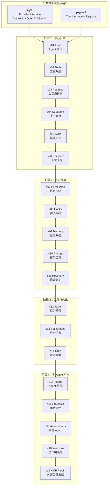

### 核心抽象

所有 19 步共享两个核心接口：

```go
// LLM Provider — 任何 LLM 后端实现此接口
type Provider interface {
    SendMessage(ctx context.Context, req *Request) (*Response, error)
}

// Tool — 每个 Agent 工具实现此接口
type Tool interface {
    Name() string
    Description() string
    Schema() any
    Execute(ctx context.Context, input map[string]any) (string, error)
}
```

### 统一消息模型

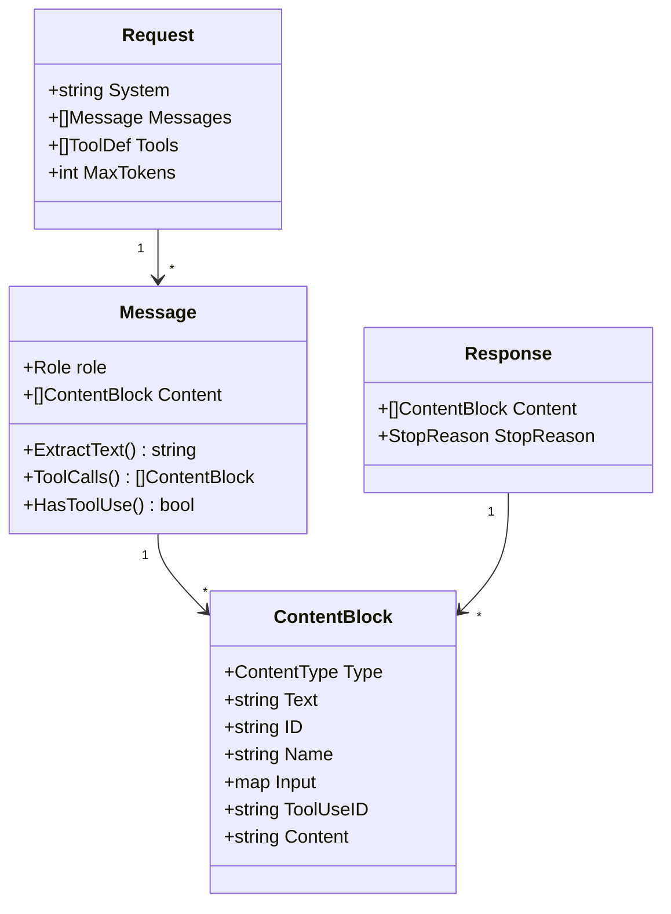

---

## 阶段 1：核心 Agent 引擎（s01-s06）

本阶段构建 Agent 的核心能力：从最简单的 LLM 调用循环，逐步添加工具系统、计划管理、子 Agent 派遣、技能加载和上下文压缩。

---

### s01 — Agent Loop（Agent 循环）

**课程目标**：实现 Agent 的"心跳" — 最小可运行的 Agent 循环。

**核心概念**：`user message → LLM reply → tool_use? → execute tools → write results → continue`

**关键文件**：
| 文件 | 职责 |
|---|---|
| `internal/s01_loop/agent.go` | 最小 Agent 循环：LoopState + RunOneTurn + Run |
| `internal/s01_loop/bash_tool.go` | 单一 bash 执行工具 |
| `cmd/s01_agent_loop/main.go` | 交互式 REPL 入口 |

**核心数据结构**：

```go
// LoopState — 贯穿所有后续步骤的状态容器
type LoopState struct {
    Messages         []llm.Message  // 完整对话历史
    TurnCount        int            // 当前轮次
    TransitionReason string         // 进入当前轮的原因
}
```

#### 架构图

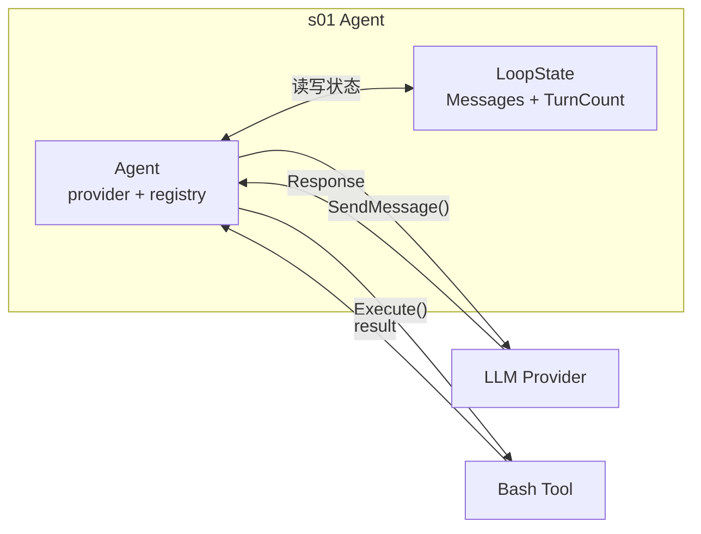

#### 交互流程

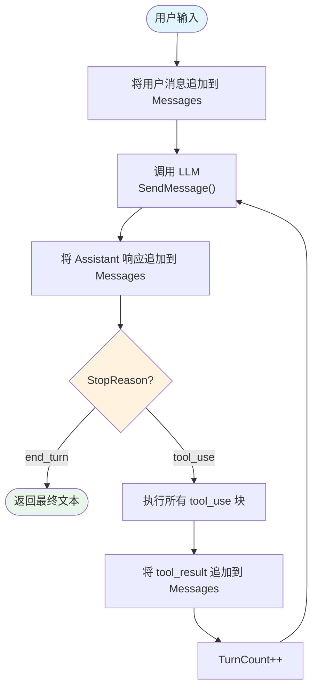

---

### s02 — Tool Use（工具系统）

**课程目标**：建立可扩展的工具体系 + 消息规范化机制。

**核心概念**：Tool 注册/分发、消息规范化（孤儿 tool_result 修复、同角色消息合并）

**关键文件**：
| 文件 | 职责 |
|---|---|
| `internal/s02_tools/agent.go` | 标准 Agent 循环（被后续所有步骤复用） |
| `internal/s02_tools/normalize.go` | `NormalizeMessages()` — 修复消息不一致 |
| `internal/s02_tools/bash_tool.go` | bash 工具（带危险命令过滤） |
| `internal/s02_tools/read_file_tool.go` | 文件读取工具 |
| `internal/s02_tools/write_file_tool.go` | 文件写入工具 |
| `internal/s02_tools/edit_file_tool.go` | 精确文本替换工具 |
| `internal/s02_tools/safepath.go` | 路径安全校验（防目录逃逸） |

#### 架构图

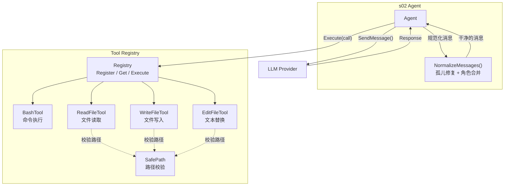

#### 消息规范化流程

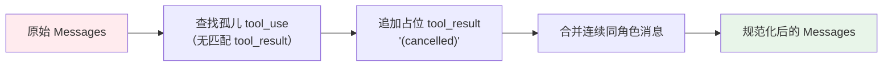

---

### s03 — Planning（会话级计划）

**课程目标**：让 Agent 拥有"工作记忆" — 会话内的轻量级任务跟踪。

**核心概念**：PlanManager 管理 PlanItem 列表，提供过期提醒机制。计划不持久化，生命周期 = 会话。

**关键文件**：
| 文件 | 职责 |
|---|---|
| `internal/s03_planning/plan.go` | PlanManager：计划项管理 + 过期提醒 |
| `internal/s03_planning/todo_tool.go` | TodoTool：plan_create / plan_update / plan_list |
| `internal/s03_planning/agent.go` | Agent + 计划过期刷新提醒注入 |

#### 架构图

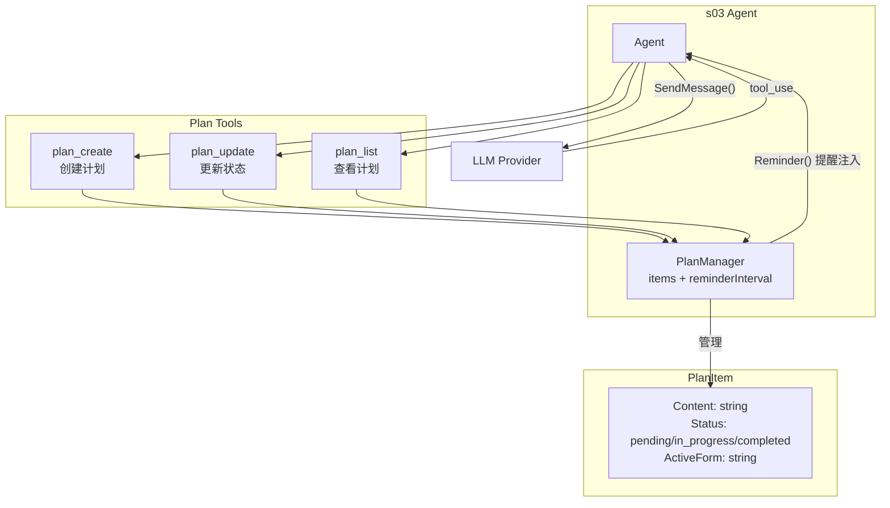

#### 交互流程

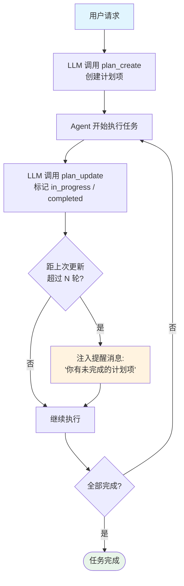

---

### s04 — Subagent（子 Agent）

**课程目标**：实现上下文隔离的子 Agent 派遣机制。

**核心概念**：子 Agent 拥有干净的消息历史和工具子集，只返回文本摘要给父 Agent。最大 30 轮。

**关键文件**：
| 文件 | 职责 |
|---|---|
| `internal/s04_subagent/agent.go` | 父 Agent 循环 + RunSubagent 函数 |
| `internal/s04_subagent/task_tool.go` | TaskTool：spawn 子 Agent |
| `internal/s04_subagent/template.go` | AgentTemplate：从 frontmatter 解析子 Agent 配置 |

#### 架构图

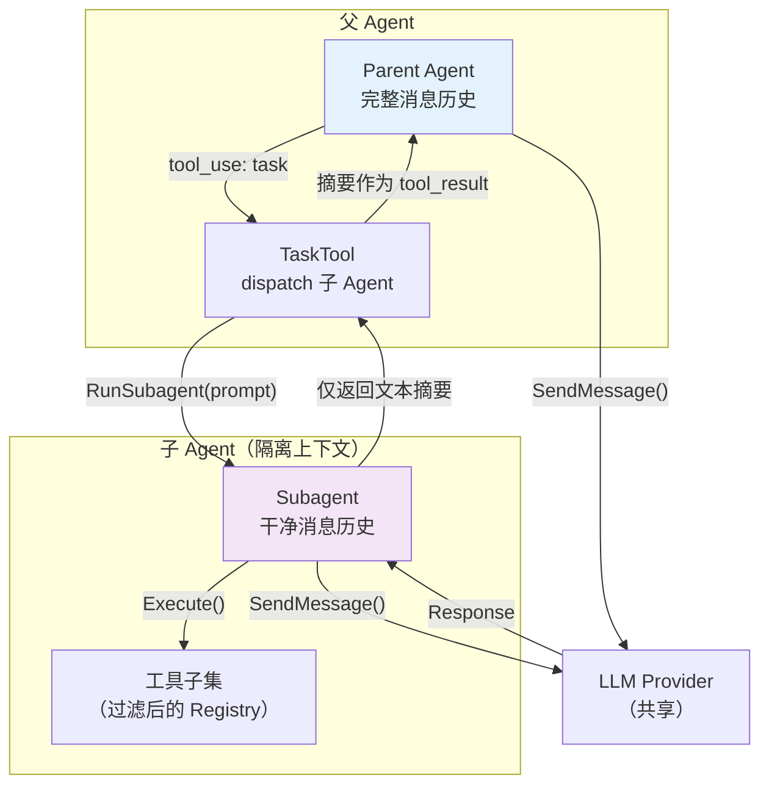

#### 交互流程

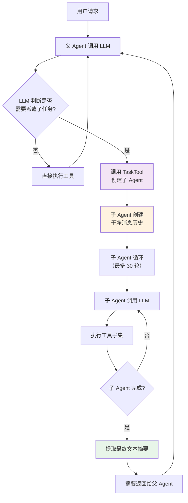

---

### s05 — Skill Loading（技能加载）

**课程目标**：实现两层技能模型 — 轻量目录 + 按需全文加载。

**核心概念**：Layer 1 = 名称+描述注入 system prompt（低开销），Layer 2 = 按需通过 Tool 加载完整技能文档。

**关键文件**：
| 文件 | 职责 |
|---|---|
| `internal/s05_skills/registry.go` | SkillRegistry：扫描 `.skills/` 目录，解析 frontmatter |
| `internal/s05_skills/load_skill_tool.go` | LoadSkillTool：按需读取技能全文 |
| `internal/s05_skills/agent.go` | Agent + Layer 1 清单注入 system prompt |

#### 架构图

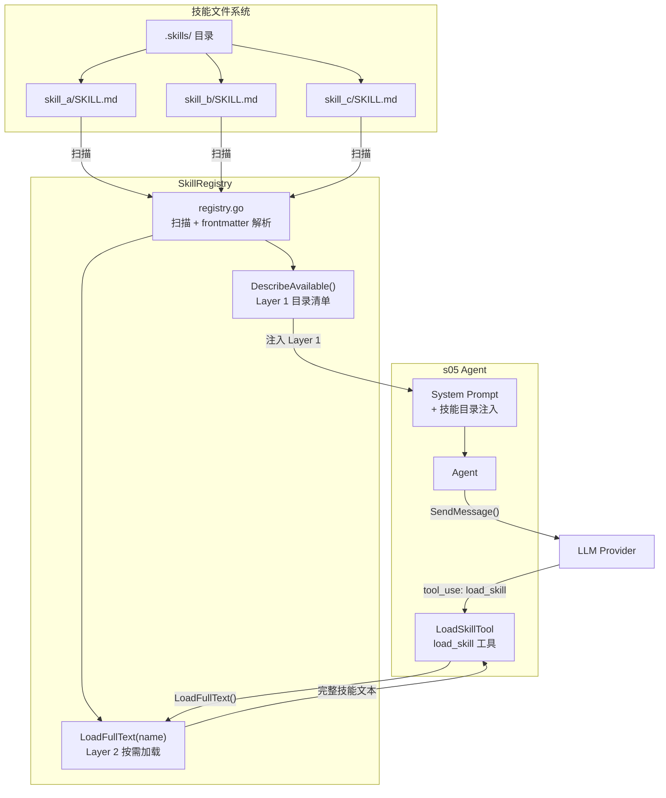

#### 两层加载流程

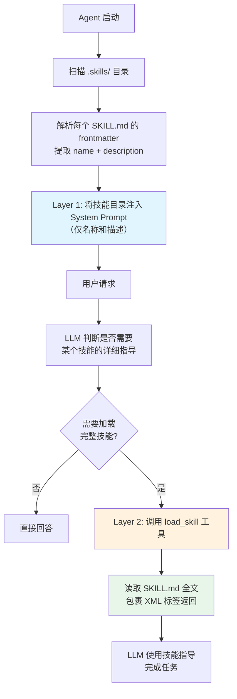

---

### s06 — Context Compaction（上下文压缩）

**课程目标**：防止长对话导致的上下文爆炸。

**核心概念**：三层压缩策略 — 大输出持久化到磁盘 → 旧 tool result 微压缩 → LLM 驱动的全量摘要。

**关键文件**：
| 文件 | 职责 |
|---|---|
| `internal/s06_compact/compact.go` | CompactState + token 估算 + 微压缩 + 持久化 + 摘要 |
| `internal/s06_compact/compact_tool.go` | CompactTool：手动触发压缩 |
| `internal/s06_compact/agent.go` | Agent + 自动压缩触发 |

#### 架构图

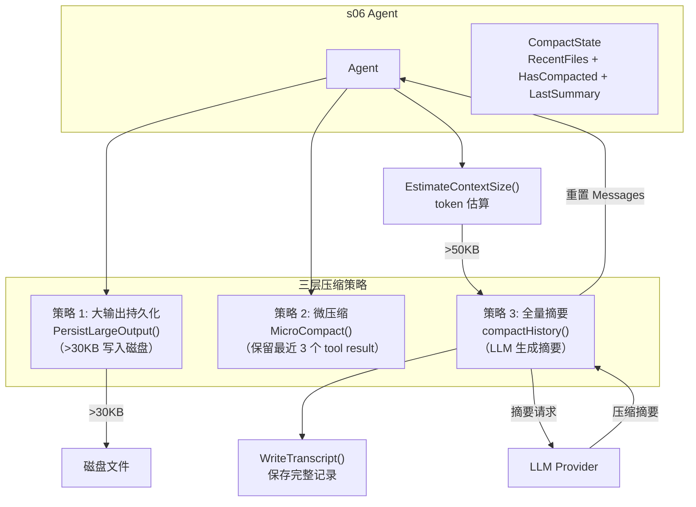

#### 压缩决策流程

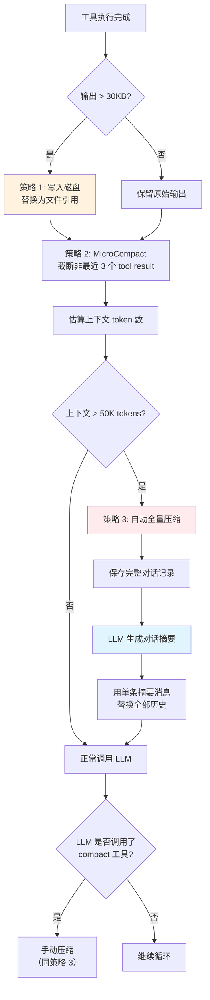

---

## 阶段 2：生产加固（s07-s11）

本阶段为 Agent 添加安全性、可扩展性和健壮性：权限控制、外部钩子、跨会话记忆、提示工程和错误恢复。

---

### s07 — Permission System（权限系统）

**课程目标**：为工具调用添加安全门控。

**核心概念**：多阶段权限管道 — deny rules → mode check → allow rules → ask user，包括危险命令检测和用户拒绝熔断。

**关键文件**：
| 文件 | 职责 |
|---|---|
| `internal/s07_permission/permission.go` | PermissionManager：管道式检查 + BashValidator |
| `internal/s07_permission/agent.go` | Agent + 权限拦截 |

#### 架构图

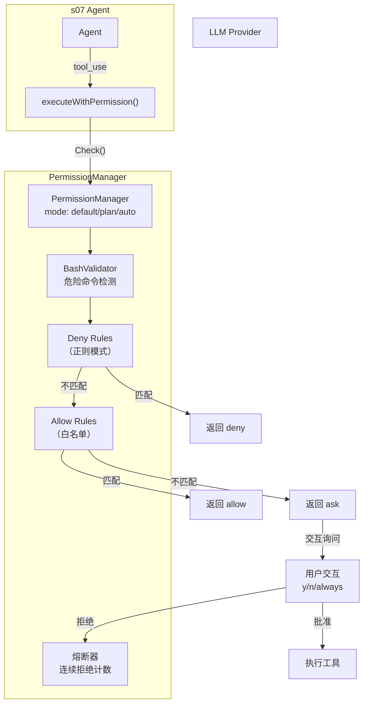

#### 权限检查流程

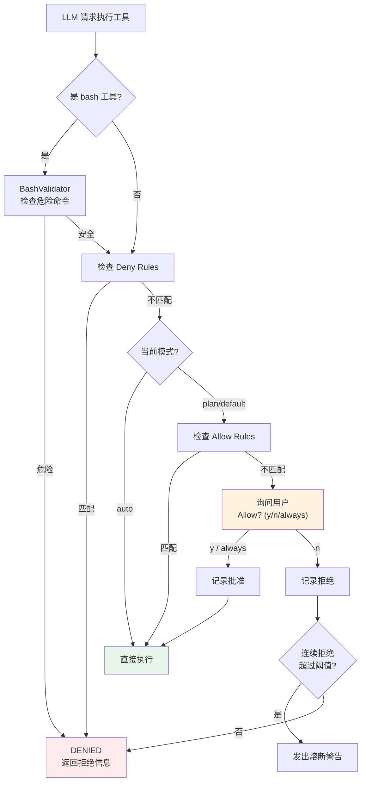

---

### s08 — Hook System（钩子系统）

**课程目标**：不修改核心代码的扩展机制。

**核心概念**：在关键生命周期节点执行外部脚本，通过退出码协议控制 Agent 行为（0=继续，1=阻止，2=注入内容）。

**关键文件**：
| 文件 | 职责 |
|---|---|
| `internal/s08_hooks/hooks.go` | HookManager：PreToolUse / PostToolUse / SessionStart |
| `internal/s08_hooks/agent.go` | Agent + hook 执行 |

#### 架构图

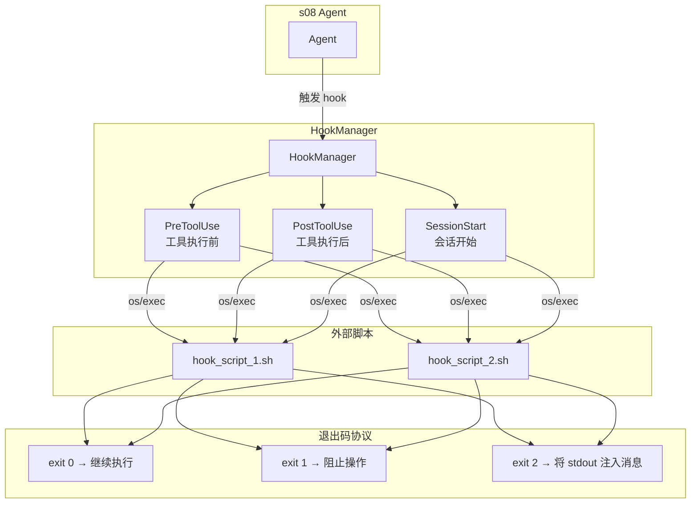

#### Hook 执行流程

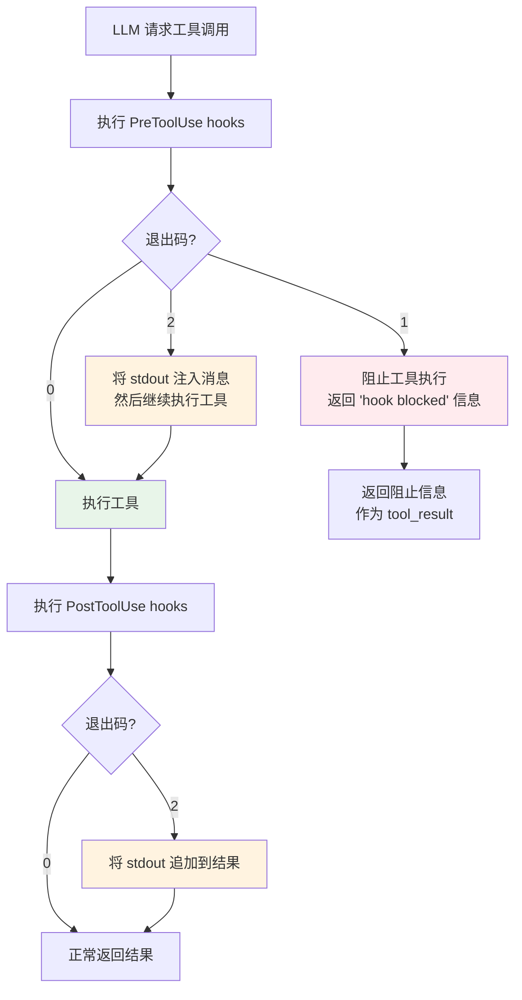

---

### s09 — Memory System（记忆系统）

**课程目标**：让 Agent 拥有跨会话的持久知识。

**核心概念**：4 类记忆（user/feedback/project/reference），每条记忆为独立 `.md` 文件 + frontmatter，`MEMORY.md` 作为索引。每轮重建 system prompt 以包含最新记忆。

**关键文件**：
| 文件 | 职责 |
|---|---|
| `internal/s09_memory/memory.go` | MemoryManager：4 类记忆管理 + MEMORY.md 索引 |
| `internal/s09_memory/save_memory_tool.go` | SaveMemoryTool：创建/更新记忆文件 |
| `internal/s09_memory/agent.go` | Agent + 记忆上下文注入 |

#### 架构图

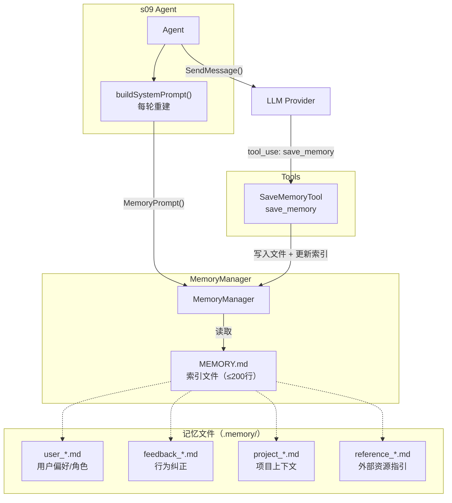

#### 记忆读写流程

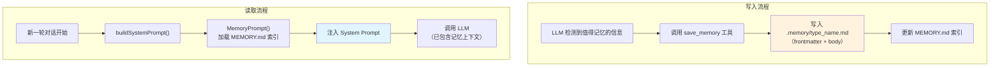

---

### s10 — System Prompt（系统提示工程）

**课程目标**：将 System Prompt 从字符串拼接升级为管道式组装。

**核心概念**：6 段管道有序组装，静态/动态边界分离，支持缓存优化。

**关键文件**：
| 文件 | 职责 |
|---|---|
| `internal/s10_prompt/builder.go` | SystemPromptBuilder：6 段管道组装 |
| `internal/s10_prompt/agent.go` | Agent + builder 驱动的 system prompt |

#### 架构图

```mermaid
graph LR
    subgraph "SystemPromptBuilder 管道"
        direction TB
        S1["1. Identity<br/>Agent 身份 + 工作目录"]
        S2["2. Environment<br/>平台、日期、Shell 信息"]
        S3["3. Tools<br/>可用工具描述"]
        S4["4. Rules<br/>CODEBUDDY.md 规则链"]
        BOUNDARY["── 静态/动态边界 ──"]
        S5["5. Memory<br/>记忆系统内容"]
        S6["6. Dynamic<br/>计划状态 + 技能目录"]
    end

    S1 --> S2 --> S3 --> S4 --> BOUNDARY --> S5 --> S6

    subgraph "缓存优化"
        STATIC["静态部分<br/>（Section 1-4）<br/>可缓存"]
        DYNAMIC["动态部分<br/>（Section 5-6）<br/>每轮重建"]
    end

    S4 -.-> STATIC
    S5 -.-> DYNAMIC

    style BOUNDARY fill:#ffe0b2,stroke:#ff9800
    style STATIC fill:#e8f5e9
    style DYNAMIC fill:#fff3e0
```

#### Prompt 组装流程

```mermaid
flowchart TD
    Build["Build() 被调用"] --> Sec1["Section 1: Identity<br/>'You are a coding agent at {cwd}'"]
    Sec1 --> Sec2["Section 2: Environment<br/>OS/Shell/Date 信息"]
    Sec2 --> Sec3["Section 3: Tools<br/>工具列表描述"]
    Sec3 --> Sec4["Section 4: Rules<br/>CODEBUDDY.md 规则<br/>（优先级链: 项目 > 用户 > 全局）"]
    Sec4 --> Cache["可缓存边界"]
    Cache --> Sec5["Section 5: Memory<br/>MEMORY.md 索引内容"]
    Sec5 --> Sec6["Section 6: Dynamic<br/>计划状态 + 技能清单"]
    Sec6 --> Final["拼接为完整 System Prompt"]

    style Cache fill:#ffe0b2
    style Final fill:#e8f5e9
```

---

### s11 — Error Recovery（错误恢复）

**课程目标**：让 Agent 能自动从各类错误中恢复。

**核心概念**：三条恢复路径 — max_tokens 续写、prompt_too_long 压缩、连接错误退避。

**关键文件**：
| 文件 | 职责 |
|---|---|
| `internal/s11_recovery/recovery.go` | token 估算、AutoCompact、退避算法、错误分类 |
| `internal/s11_recovery/agent.go` | Agent + 三路恢复循环 |

#### 架构图

```mermaid
graph TB
    subgraph "s11 Agent"
        Agent["Agent<br/>Run() 主循环"]
    end

    subgraph "三条恢复路径"
        R1["路径 1: max_tokens<br/>注入 continuation 消息<br/>（≤3 次）"]
        R2["路径 2: prompt_too_long<br/>AutoCompact 压缩上下文<br/>然后重试"]
        R3["路径 3: 连接错误<br/>指数退避<br/>1s→2s→4s...30s max<br/>± random jitter"]
    end

    LLM["LLM Provider"]
    EST["EstimateTokens()<br/>主动检测"]

    Agent -->|"SendMessage()"| LLM
    LLM -->|"max_tokens"| R1
    LLM -->|"prompt_too_long"| R2
    LLM -->|"connection error"| R3
    Agent -->|"每轮检查"| EST
    EST -->|">阈值"| R2
    R1 --> Agent
    R2 --> Agent
    R3 --> Agent
```

#### 恢复决策流程

```mermaid
flowchart TD
    Start["准备调用 LLM"] --> PreCheck{"EstimateTokens()<br/>> 阈值?"}
    PreCheck -->|"是"| ProactiveCompact["主动 AutoCompact"]
    PreCheck -->|"否"| CallLLM["调用 LLM"]
    ProactiveCompact --> CallLLM

    CallLLM --> Result{"结果?"}
    Result -->|"成功"| CheckStop{"StopReason?"}
    Result -->|"prompt_too_long"| Compact["AutoCompact<br/>压缩上下文"]
    Result -->|"连接错误"| Retry{"尝试次数<br/>< MaxRetry?"}

    Compact --> CallLLM
    Retry -->|"是"| Backoff["指数退避等待<br/>delay = min(1s×2^n, 30s)<br/>± jitter"]
    Retry -->|"否"| Fatal["返回错误"]
    Backoff --> CallLLM

    CheckStop -->|"end_turn"| Done([完成])
    CheckStop -->|"tool_use"| ExecTools["执行工具"]
    CheckStop -->|"max_tokens"| MaxTok{"续写次数<br/>< 3?"}

    MaxTok -->|"是"| Inject["注入 continuation 消息<br/>'请继续，无需重述'"]
    MaxTok -->|"否"| Done
    Inject --> CallLLM
    ExecTools --> Start

    style Compact fill:#fff3e0
    style Backoff fill:#ffebee
    style Inject fill:#e1f5fe
    style Done fill:#e8f5e9
```

---

## 阶段 3：工作持久化与后台执行（s12-s14）

本阶段让 Agent 能够管理持久任务、执行后台命令、以及按计划自动触发工作。

---

### s12 — Task System（持久任务系统）

**课程目标**：建立持久化的任务图，支持依赖关系。

**核心概念**：任务以 JSON 文件持久化到 `.tasks/` 目录，支持双向依赖同步（blockedBy / blocks）。

**关键文件**：
| 文件 | 职责 |
|---|---|
| `internal/s12_tasks/manager.go` | TaskManager：JSON 持久化 + 依赖图管理 |
| `internal/s12_tasks/task_tools.go` | 4 个工具：task_create / task_get / task_update / task_list |
| `internal/s12_tasks/agent.go` | Agent 循环 |

#### 架构图

```mermaid
graph TB
    subgraph "s12 Agent"
        Agent["Agent"]
    end

    subgraph "Task Tools"
        TC["task_create<br/>创建任务"]
        TG["task_get<br/>获取详情"]
        TU["task_update<br/>更新状态/依赖"]
        TL["task_list<br/>列出所有任务"]
    end

    subgraph "TaskManager"
        TM["TaskManager"]
        DEP["依赖图管理<br/>blockedBy ↔ blocks<br/>双向同步"]
    end

    subgraph ".tasks/ 持久化"
        T1["task_001.json"]
        T2["task_002.json"]
        T3["task_003.json"]
    end

    Agent --> TC & TG & TU & TL
    TC & TG & TU & TL --> TM
    TM --> DEP
    TM <-->|"JSON 读写"| T1 & T2 & T3
```

#### 任务依赖流程

```mermaid
flowchart TD
    Create["task_create<br/>创建任务 A, B, C"] --> SetDep["task_update<br/>C.addBlockedBy = [A, B]"]
    SetDep --> AutoSync["自动双向同步:<br/>A.blocks += [C]<br/>B.blocks += [C]"]
    AutoSync --> WorkA["开始执行任务 A"]
    WorkA --> CompleteA["task_update: A → completed"]
    CompleteA --> ClearA["clearDependency(A):<br/>从 C.blockedBy 中移除 A"]
    ClearA --> WorkB["开始执行任务 B"]
    WorkB --> CompleteB["task_update: B → completed"]
    CompleteB --> ClearB["clearDependency(B):<br/>从 C.blockedBy 中移除 B"]
    ClearB --> Unblocked["C.blockedBy = []<br/>任务 C 解除阻塞"]
    Unblocked --> WorkC["开始执行任务 C"]

    style AutoSync fill:#e1f5fe
    style Unblocked fill:#e8f5e9
```

---

### s13 — Background Tasks（后台任务）

**课程目标**：让 Agent 能非阻塞地执行长时间命令。

**核心概念**：后台命令在 goroutine 中执行，完成后推入通知队列。Agent 每轮 LLM 调用前先 drain 通知并注入消息。

**关键文件**：
| 文件 | 职责 |
|---|---|
| `internal/s13_background/background.go` | BackgroundManager：goroutine 执行 + 通知队列 |
| `internal/s13_background/bg_tools.go` | background_run / check_background 工具 |
| `internal/s13_background/agent.go` | Agent + drain-before-LLM 模式 |

#### 架构图

```mermaid
graph TB
    subgraph "s13 Agent（主 goroutine）"
        Agent["Agent<br/>Run() 主循环"]
        Drain["DrainNotifications()<br/>每轮 LLM 调用前"]
    end

    subgraph "BackgroundManager"
        BM["BackgroundManager"]
        Q["通知队列<br/>[]Notification"]
    end

    subgraph "后台 goroutine 池"
        G1["goroutine 1<br/>运行长命令"]
        G2["goroutine 2<br/>运行长命令"]
    end

    subgraph "Background Tools"
        BR["background_run<br/>启动后台任务"]
        CB["check_background<br/>查看任务状态"]
    end

    LLM["LLM Provider"]

    Agent -->|"tool_use"| BR
    BR -->|"启动"| BM
    BM -->|"spawn"| G1 & G2
    G1 & G2 -->|"完成时推入"| Q
    Agent --> Drain
    Drain -->|"取出通知"| Q
    Drain -->|"注入 <background-results>"| Agent
    Agent -->|"SendMessage()"| LLM
    Agent -->|"tool_use"| CB
    CB -->|"查询状态"| BM
```

#### 后台任务交互流程

```mermaid
flowchart TD
    UserReq["用户请求长时间操作"] --> LLMDecide["LLM 调用 background_run"]
    LLMDecide --> Spawn["BackgroundManager 在 goroutine 中<br/>启动命令"]
    Spawn --> Immediate["立即返回 task_id"]
    Immediate --> Continue["Agent 继续处理其他事务"]

    subgraph "后台执行"
        BG["goroutine 执行命令"]
        BG --> Complete["执行完成"]
        Complete --> Push["推入通知队列<br/>{taskID, status, preview, outputFile}"]
    end

    Continue --> NextTurn["下一轮 LLM 调用前"]
    NextTurn --> DrainQ["DrainNotifications()"]
    Push -.->|"异步"| DrainQ
    DrainQ --> Inject["注入 <background-results> 消息"]
    Inject --> LLMProcess["LLM 处理后台结果"]

    style Spawn fill:#e1f5fe
    style Immediate fill:#e8f5e9
    style Push fill:#fff3e0
```

---

### s14 — Cron Scheduler（定时调度）

**课程目标**：让 Agent 能按计划自动触发工作。

**核心概念**：完整 5 字段 cron 解析，后台 goroutine 每秒 tick，支持 recurring/one-shot + durable/session 模式。

**关键文件**：
| 文件 | 职责 |
|---|---|
| `internal/s14_cron/cron.go` | CronScheduler：解析 + tick + jitter + 过期 |
| `internal/s14_cron/cron_tools.go` | cron_create / cron_delete / cron_list 工具 |
| `internal/s14_cron/agent.go` | Agent + cron 通知 drain |

#### 架构图

```mermaid
graph TB
    subgraph "s14 Agent（主 goroutine）"
        Agent["Agent<br/>Run() 主循环"]
        Drain["DrainNotifications()<br/>每轮 LLM 调用前"]
    end

    subgraph "CronScheduler"
        CS["CronScheduler"]
        PARSE["5 字段解析器<br/>min hour dom month dow"]
        TICK["后台 goroutine<br/>每秒 tick"]
        JOBS["Job 列表"]
        NOTIF["通知队列"]
    end

    subgraph "Cron Tools"
        CC["cron_create<br/>创建定时任务"]
        CD["cron_delete<br/>删除定时任务"]
        CL["cron_list<br/>列出所有任务"]
    end

    LLM["LLM Provider"]

    Agent -->|"tool_use"| CC & CD & CL
    CC & CD & CL --> CS
    CS --> PARSE
    TICK -->|"每秒检查"| JOBS
    JOBS -->|"触发时"| NOTIF
    Agent --> Drain
    Drain -->|"取出通知"| NOTIF
    Drain -->|"注入 cron 消息"| Agent
    Agent -->|"SendMessage()"| LLM
```

#### Cron 触发流程

```mermaid
flowchart TD
    Create["LLM 调用 cron_create<br/>schedule='*/5 * * * *'<br/>prompt='检查测试状态'"] --> Parse["解析 cron 表达式"]
    Parse --> Register["注册到 Job 列表"]
    Register --> Tick["后台 goroutine<br/>每秒 tick"]

    Tick --> Match{"当前时间匹配<br/>cron 表达式?"}
    Match -->|"否"| Tick
    Match -->|"是"| Jitter["添加 FNV hash jitter<br/>防止同一秒密集触发"]
    Jitter --> Fire["触发 Job<br/>将 prompt 推入通知队列"]

    Fire --> CheckType{"Job 类型?"}
    CheckType -->|"one-shot"| Remove["从列表移除"]
    CheckType -->|"recurring"| Tick

    Fire --> AgentDrain["Agent 下轮 drain 通知"]
    AgentDrain --> InjectMsg["注入 cron 消息到对话"]
    InjectMsg --> LLMProcess["LLM 处理定时任务"]

    style Fire fill:#fff3e0
    style InjectMsg fill:#e1f5fe
```

---

## 阶段 4：多 Agent 平台与外部集成（s15-s19）

本阶段构建完整的多 Agent 协作平台：团队管理、结构化协议、自主工作、工作树隔离、以及外部工具标准化接入。

---

### s15 — Agent Teams（Agent 团队）

**课程目标**：实现多 Agent 协作 — 命名 Agent + JSONL 消息通信。

**核心概念**：Lead Agent 管理团队，通过 MessageBus（JSONL 收件箱）通信。每个 Teammate 是独立 goroutine，拥有绑定 sender 的专属工具集。

**关键文件**：
| 文件 | 职责 |
|---|---|
| `internal/s15_teams/message_bus.go` | MessageBus：JSONL 收件箱，Send / ReadInbox / Broadcast |
| `internal/s15_teams/teammate.go` | TeammateManager：spawn goroutine + 绑定 tool 集 |
| `internal/s15_teams/lead_tools.go` | 5 个 lead 工具：spawn / list / send / read / broadcast |
| `internal/s15_teams/agent.go` | Lead Agent + inbox drain |

#### 架构图

```mermaid
graph TB
    subgraph "Lead Agent（主 goroutine）"
        Lead["Lead Agent"]
        LeadInbox["lead inbox<br/>.team/inbox/lead.jsonl"]
        LeadTools["Lead 工具集<br/>spawn / list / send<br/>read_inbox / broadcast"]
    end

    subgraph "MessageBus"
        BUS["MessageBus<br/>JSONL 文件通信"]
    end

    subgraph "Teammate A（goroutine）"
        TA["Teammate A"]
        TA_Inbox["inbox/a.jsonl"]
        TA_Tools["A 的工具集<br/>send_message（sender=A）<br/>read_inbox（owner=A）<br/>+ 通用工具"]
    end

    subgraph "Teammate B（goroutine）"
        TB["Teammate B"]
        TB_Inbox["inbox/b.jsonl"]
        TB_Tools["B 的工具集<br/>send_message（sender=B）<br/>read_inbox（owner=B）<br/>+ 通用工具"]
    end

    LLM["LLM Provider<br/>（共享）"]

    Lead -->|"spawn"| TA & TB
    Lead -->|"send"| BUS
    TA -->|"send"| BUS
    TB -->|"send"| BUS
    BUS -->|"写入"| LeadInbox & TA_Inbox & TB_Inbox
    Lead -->|"ReadInbox"| LeadInbox
    TA -->|"ReadInbox"| TA_Inbox
    TB -->|"ReadInbox"| TB_Inbox

    Lead & TA & TB -->|"SendMessage()"| LLM
```

#### 团队协作流程

```mermaid
flowchart TD
    UserReq["用户请求复杂任务"] --> LeadAnalyze["Lead Agent 分析任务"]
    LeadAnalyze --> SpawnTeam["调用 spawn 工具<br/>创建 Teammate A, B"]

    SpawnTeam --> TeamStart["Teammate 作为独立 goroutine 启动<br/>各自拥有：<br/>- 独立消息历史<br/>- 绑定 sender 的工具<br/>- 最多 50 轮"]

    TeamStart --> ParallelWork["Teammate A 和 B<br/>并行工作"]

    subgraph "Teammate A"
        A_Work["A 执行子任务"]
        A_Report["A 调用 send_message<br/>向 lead 报告结果"]
    end

    subgraph "Teammate B"
        B_Work["B 执行子任务"]
        B_Report["B 调用 send_message<br/>向 lead 报告结果"]
    end

    ParallelWork --> A_Work & B_Work
    A_Work --> A_Report
    B_Work --> B_Report

    A_Report & B_Report --> BusSend["MessageBus 写入<br/>lead.jsonl"]
    BusSend --> LeadDrain["Lead 下轮 drain inbox"]
    LeadDrain --> LeadProcess["Lead 处理结果<br/>汇总/协调"]
    LeadProcess --> Broadcast["broadcast 给团队<br/>或返回最终结果"]

    style SpawnTeam fill:#e1f5fe
    style ParallelWork fill:#fff3e0
    style LeadProcess fill:#e8f5e9
```

---

### s16 — Team Protocols（团队协议）

**课程目标**：为多 Agent 协作添加结构化的请求-响应协议。

**核心概念**：两种协议 — Shutdown（请求关闭）和 Plan Approval（计划审批），通过 RequestStore 持久化协议状态，实现 FSM（有限状态机）。

**关键文件**：
| 文件 | 职责 |
|---|---|
| `internal/s16_protocols/message_bus.go` | 扩展 InboxMessage（RequestID / Approve / Plan / Feedback） |
| `internal/s16_protocols/request_store.go` | RequestStore：`.team/requests/` JSON 持久化 |
| `internal/s16_protocols/teammate.go` | Teammate + 协议工具（shutdown_response / plan_approval） |
| `internal/s16_protocols/lead_tools.go` | 12 个 lead 工具（+3 协议工具） |
| `internal/s16_protocols/agent.go` | Lead Agent |

#### 架构图

```mermaid
graph TB
    subgraph "Lead Agent"
        Lead["Lead Agent"]
        LT["协议工具:<br/>shutdown_request<br/>check_request_status<br/>plan_review"]
    end

    subgraph "RequestStore"
        RS[".team/requests/<br/>每个请求一个 JSON"]
        FSM["FSM 状态机<br/>pending → approved/rejected"]
    end

    subgraph "MessageBus（扩展）"
        BUS["MessageBus"]
        MSG["InboxMessage 扩展字段:<br/>RequestID<br/>Approve<br/>Plan<br/>Feedback"]
    end

    subgraph "Teammate"
        TM["Teammate"]
        TT["协议工具:<br/>shutdown_response<br/>plan_approval_response"]
    end

    Lead -->|"发起请求"| LT
    LT -->|"创建请求记录"| RS
    LT -->|"发送协议消息"| BUS
    BUS -->|"投递到 inbox"| TM
    TM -->|"处理请求"| TT
    TT -->|"响应消息"| BUS
    BUS -->|"投递到 inbox"| Lead
    TT -->|"更新状态"| RS
```

#### Shutdown 协议流程

```mermaid
flowchart TD
    LeadDecide["Lead 决定关闭 Teammate X"] --> SendReq["调用 shutdown_request<br/>创建 RequestID"]
    SendReq --> StoreReq["RequestStore 持久化<br/>status: pending"]
    StoreReq --> SendMsg["通过 MessageBus<br/>发送 shutdown_request 消息"]
    SendMsg --> TmReceive["Teammate X<br/>inbox drain 收到请求"]

    TmReceive --> TmDecide{"Teammate X 决定"}
    TmDecide -->|"同意"| TmApprove["调用 shutdown_response<br/>approve: true"]
    TmDecide -->|"拒绝"| TmReject["调用 shutdown_response<br/>approve: false<br/>+ 拒绝理由"]

    TmApprove --> UpdateApprove["RequestStore<br/>status: approved"]
    TmReject --> UpdateReject["RequestStore<br/>status: rejected"]

    UpdateApprove --> SendResp1["响应消息<br/>发送给 Lead"]
    UpdateReject --> SendResp2["响应消息<br/>发送给 Lead"]
    UpdateApprove --> Shutdown["Teammate X 退出"]

    SendResp1 --> LeadRead["Lead drain inbox<br/>收到确认"]
    SendResp2 --> LeadRead2["Lead drain inbox<br/>收到拒绝理由"]

    style SendReq fill:#e1f5fe
    style Shutdown fill:#ffebee
    style TmDecide fill:#fff3e0
```

#### Plan Approval 协议流程

```mermaid
flowchart TD
    TmPlan["Teammate 完成计划<br/>调用 ExitPlanMode"] --> Submit["提交计划<br/>创建 plan_approval 请求"]
    Submit --> StoreReq["RequestStore 持久化<br/>status: pending"]
    StoreReq --> SendToLead["发送 plan_approval<br/>消息给 Lead"]

    SendToLead --> LeadReview["Lead 收到计划"]
    LeadReview --> LeadDecide{"Lead 审查"}

    LeadDecide -->|"批准"| Approve["调用 plan_review<br/>approve: true"]
    LeadDecide -->|"拒绝"| Reject["调用 plan_review<br/>approve: false<br/>+ 反馈意见"]

    Approve --> NotifyApprove["通知 Teammate<br/>计划已批准"]
    Reject --> NotifyReject["通知 Teammate<br/>计划被拒绝 + 反馈"]

    NotifyApprove --> TmExitPlan["Teammate 退出计划模式<br/>开始实施"]
    NotifyReject --> TmRevise["Teammate 修改计划<br/>重新提交"]
    TmRevise --> Submit

    style Submit fill:#e1f5fe
    style TmExitPlan fill:#e8f5e9
    style TmRevise fill:#fff3e0
```

---

### s17 — Autonomous Agents（自主 Agent）

**课程目标**：让 Teammate 能自主发现和认领工作。

**核心概念**：TaskBoard 提供共享任务池，Teammate 在 WORK→IDLE 循环中自动轮询未认领的任务，通过互斥锁防止竞争。

**关键文件**：
| 文件 | 职责 |
|---|---|
| `internal/s17_autonomous/task_board.go` | ScanUnclaimedTasks + ClaimTask（互斥锁 + 事件日志） |
| `internal/s17_autonomous/teammate.go` | autonomousLoop：WORK→IDLE 周期 |
| `internal/s17_autonomous/lead_tools.go` | 13 个 lead 工具（+LeadClaimTaskTool） |
| `internal/s17_autonomous/agent.go` | Lead Agent |

#### 架构图

```mermaid
graph TB
    subgraph "Lead Agent"
        Lead["Lead Agent"]
        LCT["LeadClaimTaskTool<br/>手动分配任务"]
    end

    subgraph "TaskBoard（共享任务池）"
        TB["TaskBoard<br/>.tasks/ JSON 文件"]
        SCAN["ScanUnclaimedTasks()<br/>查找未认领任务"]
        CLAIM["ClaimTask()<br/>互斥锁 + 原子认领"]
        LOG["事件日志<br/>claim_events.jsonl"]
    end

    subgraph "Teammate A（自主循环）"
        TA["autonomousLoop"]
        TA_WORK["WORK 状态<br/>执行已认领的任务"]
        TA_IDLE["IDLE 状态<br/>5s 轮询新任务"]
        TA_CLAIM["claim_task 工具"]
    end

    subgraph "Teammate B（自主循环）"
        TB_A["autonomousLoop"]
        TB_WORK["WORK 状态"]
        TB_IDLE["IDLE 状态"]
    end

    Lead -->|"创建任务"| TB
    Lead -->|"手动分配"| LCT --> TB
    TA_IDLE -->|"ScanUnclaimedTasks"| SCAN
    SCAN -->|"发现任务"| TA_CLAIM
    TA_CLAIM -->|"ClaimTask()"| CLAIM
    CLAIM -->|"记录"| LOG
    CLAIM -->|"认领成功"| TA_WORK
    TA_WORK -->|"完成"| TA_IDLE
```

#### 自主工作循环

```mermaid
flowchart TD
    Start["Teammate 启动"] --> InjectIdentity["ensureIdentityContext<br/>注入 <identity> 块"]
    InjectIdentity --> IdleState["进入 IDLE 状态"]

    IdleState --> Poll["调用 idle 工具<br/>（等待 5 秒）"]
    Poll --> Scan["ScanUnclaimedTasks()<br/>查找可用任务"]
    Scan --> Found{"找到未认领任务?"}

    Found -->|"否"| TimeoutCheck{"IDLE 超过 60s?"}
    TimeoutCheck -->|"否"| Poll
    TimeoutCheck -->|"是"| AutoShutdown["自动关闭"]

    Found -->|"是"| Claim["ClaimTask()<br/>互斥锁原子认领"]
    Claim --> Success{"认领成功?"}
    Success -->|"否（被其他 Agent 抢占）"| Poll
    Success -->|"是"| WorkState["进入 WORK 状态"]

    WorkState --> ExecTask["执行任务<br/>使用 LLM + 工具"]
    ExecTask --> Complete["任务完成<br/>更新 status: completed"]
    Complete --> Report["send_message 给 Lead"]
    Report --> IdleState

    style IdleState fill:#fff3e0
    style WorkState fill:#e1f5fe
    style Complete fill:#e8f5e9
    style AutoShutdown fill:#ffebee
```

---

### s18 — Worktree Isolation（工作树隔离）

**课程目标**：用 Git worktree 为每个任务提供独立的文件系统隔离。

**核心概念**：任务是控制平面，worktree 是执行平面。WorktreeManager 封装 git 命令，EventBus 提供全链路可观测性。

**关键文件**：
| 文件 | 职责 |
|---|---|
| `internal/s18_worktree/worktree.go` | WorktreeManager：create / enter / run / remove / keep / closeout |
| `internal/s18_worktree/event_bus.go` | EventBus：append-only JSONL 生命周期事件 |
| `internal/s18_worktree/task_manager.go` | WTaskRecord（扩展 worktree 绑定字段）+ TaskManager |
| `internal/s18_worktree/tools.go` | 14 个工具（5 task + 9 worktree） |
| `internal/s18_worktree/agent.go` | Agent 循环 |

#### 架构图

```mermaid
graph TB
    subgraph "s18 Agent"
        Agent["Agent"]
    end

    subgraph "控制平面（Task）"
        TM["TaskManager"]
        TASK["WTaskRecord<br/>task + worktree 绑定"]
        T_TOOLS["Task 工具 × 5<br/>create / get / update<br/>list / assign_worktree"]
    end

    subgraph "执行平面（Worktree）"
        WM["WorktreeManager"]
        WT["Git Worktree<br/>独立工作目录"]
        W_TOOLS["Worktree 工具 × 9<br/>create / enter / run<br/>status / diff / keep<br/>remove / closeout / list"]
    end

    subgraph "可观测性"
        EB["EventBus<br/>JSONL 事件日志"]
        EVENTS["事件类型:<br/>worktree_created<br/>worktree_entered<br/>task_assigned<br/>worktree_removed<br/>..."]
    end

    GIT["Git 命令"]

    Agent --> T_TOOLS & W_TOOLS
    T_TOOLS --> TM
    TM --> TASK
    W_TOOLS --> WM
    WM -->|"git worktree add/remove"| GIT
    WM --> WT
    TASK <-->|"绑定"| WT
    WM -->|"记录事件"| EB
    TM -->|"记录事件"| EB
    EB --> EVENTS
```

#### Worktree 工作流程

```mermaid
flowchart TD
    CreateTask["task_create<br/>创建任务"] --> CreateWT["worktree_create<br/>git worktree add -b feature/xxx"]
    CreateWT --> EventCreate["EventBus 记录<br/>worktree_created"]
    EventCreate --> Bind["assign_worktree<br/>将 worktree 绑定到 task"]
    Bind --> Enter["worktree_enter<br/>切换工作目录"]
    Enter --> EventEnter["EventBus 记录<br/>worktree_entered"]

    EventEnter --> Work["在隔离的 worktree 中<br/>执行开发工作"]
    Work --> RunCmd["worktree_run<br/>在 worktree 目录执行命令"]
    RunCmd --> CheckDiff["worktree_diff<br/>查看变更"]

    CheckDiff --> Decision{"工作结果?"}
    Decision -->|"保留"| Keep["worktree_keep<br/>保留更改"]
    Decision -->|"废弃"| Remove["worktree_remove<br/>git worktree remove"]

    Keep --> Closeout["worktree_closeout<br/>合并回主分支"]
    Closeout --> UpdateTask["task_update<br/>标记任务完成"]
    Remove --> EventRemove["EventBus 记录<br/>worktree_removed"]

    style CreateWT fill:#e1f5fe
    style Work fill:#fff3e0
    style Closeout fill:#e8f5e9
    style Remove fill:#ffebee
```

---

### s19 — MCP & Plugin（外部工具集成）

**课程目标**：通过 Model Context Protocol 标准化接入外部工具服务。

**核心概念**：MCPClient 通过 stdio JSON-RPC 2.0 与外部 MCP 服务器通信，MCPToolRouter 统一路由 `mcp__{server}__{tool}` 前缀的工具。CapabilityPermissionGate 对原生工具和 MCP 工具执行统一的权限检查。

**关键文件**：
| 文件 | 职责 |
|---|---|
| `internal/s19_mcp_plugin/mcp_client.go` | MCPClient：stdio JSON-RPC 2.0 通信 |
| `internal/s19_mcp_plugin/mcp_router.go` | MCPToolRouter：前缀路由 + BuildToolPool 合并 |
| `internal/s19_mcp_plugin/plugin_loader.go` | PluginLoader：扫描 plugin.json manifest |
| `internal/s19_mcp_plugin/permission.go` | CapabilityPermissionGate：统一权限门控 |
| `internal/s19_mcp_plugin/agent.go` | Agent + 统一分发 |

#### 架构图

```mermaid
graph TB
    subgraph "s19 Agent"
        Agent["Agent"]
        EXEC["executeTool()<br/>统一分发"]
    end

    subgraph "CapabilityPermissionGate"
        GATE["统一权限门控<br/>native + MCP 相同规则"]
        RISK["风险分级<br/>low / medium / high"]
        INTENT["CapabilityIntent<br/>Source + Server + Tool + Risk"]
    end

    subgraph "原生工具"
        REG["Tool Registry<br/>bash / read / write / edit"]
    end

    subgraph "MCP 工具"
        ROUTER["MCPToolRouter<br/>mcp__{server}__{tool} 路由"]
        CLIENT1["MCPClient: server_a<br/>stdio JSON-RPC 2.0"]
        CLIENT2["MCPClient: server_b<br/>stdio JSON-RPC 2.0"]
    end

    subgraph "外部 MCP 服务器"
        SRV1["MCP Server A<br/>（子进程）"]
        SRV2["MCP Server B<br/>（子进程）"]
    end

    subgraph "BuildToolPool"
        POOL["合并工具池<br/>native tools + MCP tools<br/>→ 统一 []ToolDef"]
    end

    LLM["LLM Provider"]
    PL["PluginLoader<br/>plugin.json"]

    PL -->|"扫描配置"| ROUTER
    ROUTER --> CLIENT1 & CLIENT2
    CLIENT1 -->|"stdio"| SRV1
    CLIENT2 -->|"stdio"| SRV2

    REG --> POOL
    ROUTER -->|"GetAllTools()"| POOL
    POOL -->|"统一 ToolDef 列表"| LLM

    Agent -->|"SendMessage(tools)"| LLM
    LLM -->|"tool_use"| Agent
    Agent -->|"Check()"| GATE
    GATE -->|"allow"| EXEC
    GATE -->|"deny"| DENIED["返回拒绝"]
    GATE -->|"ask"| USER["交互询问用户"]
    USER -->|"批准"| EXEC
    EXEC -->|"原生工具"| REG
    EXEC -->|"MCP 工具"| ROUTER
```

#### MCP 工具调用流程

```mermaid
flowchart TD
    LLMResp["LLM 返回 tool_use<br/>name='mcp__github__create_issue'"] --> GateCheck["CapabilityPermissionGate.Check()"]
    GateCheck --> ParseIntent["解析 CapabilityIntent:<br/>Source=mcp, Server=github<br/>Tool=create_issue, Risk=medium"]
    ParseIntent --> Decision{"权限决策?"}

    Decision -->|"allow"| Dispatch["executeTool()"]
    Decision -->|"deny"| Denied["返回 Permission denied"]
    Decision -->|"ask"| AskUser["询问用户<br/>Allow? (y/n)"]
    AskUser -->|"y"| Dispatch
    AskUser -->|"n"| Denied

    Dispatch --> IsMCP{"IsMCPTool()?"}
    IsMCP -->|"是"| MCPRoute["MCPToolRouter.Call()"]
    IsMCP -->|"否"| NativeExec["Registry.Execute()"]

    MCPRoute --> ParsePrefix["解析前缀<br/>mcp__github__create_issue<br/>→ server=github, tool=create_issue"]
    ParsePrefix --> FindClient["查找 MCPClient<br/>clients['github']"]
    FindClient --> JSONRPCCall["JSON-RPC 2.0 调用<br/>method='tools/call'<br/>params={name, arguments}"]
    JSONRPCCall --> ServerExec["MCP Server 执行"]
    ServerExec --> Response["返回结果"]

    NativeExec --> Response
    Response --> Normalize["normalizeToolResult()<br/>统一格式化<br/>{source, server, tool, risk, status, output}"]

    style GateCheck fill:#fff3e0
    style Dispatch fill:#e1f5fe
    style Response fill:#e8f5e9
```

#### MCP 连接生命周期

```mermaid
flowchart TD
    LoadPlugin["PluginLoader 扫描<br/>.claude-plugin/plugin.json"] --> ParseManifest["解析 manifest<br/>server_name, command, args, env"]
    ParseManifest --> CreateClient["NewMCPClient()"]
    CreateClient --> Connect["Connect()<br/>启动子进程"]
    Connect --> Handshake["JSON-RPC 握手<br/>method='initialize'"]
    Handshake --> ListTools["ListTools()<br/>获取服务器工具列表"]
    ListTools --> PrefixTools["生成前缀工具名<br/>mcp__{server}__{tool}"]
    PrefixTools --> RegisterRouter["注册到 MCPToolRouter"]
    RegisterRouter --> Ready["就绪<br/>工具可被 LLM 调用"]

    Ready --> Usage["正常使用<br/>CallTool() 执行调用"]
    Usage --> Shutdown["Agent 关闭"]
    Shutdown --> Disconnect["DisconnectAll()<br/>终止所有 MCP 子进程"]

    style Connect fill:#e1f5fe
    style Ready fill:#e8f5e9
    style Disconnect fill:#ffebee
```

---

## 核心抽象与公共基础设施

### pkg/llm — LLM 抽象层

```mermaid
graph TB
    subgraph "Provider 工厂"
        ENV["环境变量<br/>PROVIDER_TYPE<br/>API_KEY<br/>MODEL_ID"]
        FACTORY["NewProviderFromEnv()"]
        REG["RegisterProvider()<br/>init() 自注册"]
    end

    subgraph "Provider 实现"
        ANTH["anthropic.Client<br/>Messages API"]
        OAI["openai.Client<br/>Chat Completions API"]
        GEM["gemini.Client<br/>generateContent API"]
    end

    subgraph "统一接口"
        IFACE["Provider interface<br/>SendMessage(ctx, *Request) (*Response, error)"]
    end

    ENV --> FACTORY
    FACTORY --> IFACE
    ANTH -->|"init() 注册"| REG
    OAI -->|"init() 注册"| REG
    GEM -->|"init() 注册"| REG
    REG --> FACTORY
    ANTH & OAI & GEM -.->|"实现"| IFACE
```

### pkg/tool — 工具系统

```mermaid
graph TB
    subgraph "Tool Registry"
        REG["Registry<br/>tools map + order slice"]
        REGISTER["Register(t Tool)"]
        DEFS["ToolDefs() []ToolDef"]
        EXEC["Execute(ctx, call) ContentBlock"]
    end

    subgraph "Tool Interface"
        TOOL["Tool interface<br/>Name() / Description() / Schema() / Execute()"]
    end

    subgraph "具体工具实现"
        BASH["BashTool"]
        READ["ReadFileTool"]
        WRITE["WriteFileTool"]
        EDIT["EditFileTool"]
        PLAN["PlanTool"]
        TASK["TaskTool"]
        BG["BackgroundRunTool"]
        CRON["CronCreateTool"]
        SEND["SendMessageTool"]
        MORE["...更多"]
    end

    BASH & READ & WRITE & EDIT & PLAN & TASK & BG & CRON & SEND & MORE -.->|"实现"| TOOL
    TOOL -->|"注册到"| REG
    REG --> REGISTER & DEFS & EXEC
```

### 各阶段的能力递进总结

```mermaid
graph LR
    subgraph "阶段 1: 能做事"
        A1["循环"] --> A2["工具"]
        A2 --> A3["计划"]
        A3 --> A4["委托"]
        A4 --> A5["技能"]
        A5 --> A6["压缩"]
    end

    subgraph "阶段 2: 做得安全"
        B1["权限"] --> B2["钩子"]
        B2 --> B3["记忆"]
        B3 --> B4["提示"]
        B4 --> B5["恢复"]
    end

    subgraph "阶段 3: 做得持久"
        C1["任务"] --> C2["后台"]
        C2 --> C3["定时"]
    end

    subgraph "阶段 4: 做得协同"
        D1["团队"] --> D2["协议"]
        D2 --> D3["自主"]
        D3 --> D4["隔离"]
        D4 --> D5["扩展"]
    end

    A6 --> B1
    B5 --> C1
    C3 --> D1
```

| 阶段 | 关键词 | 核心能力 |
|---|---|---|
| 阶段 1 (s01-s06) | **能做事** | LLM 循环、工具调用、计划管理、子 Agent 委托、技能加载、上下文压缩 |
| 阶段 2 (s07-s11) | **做得安全** | 权限管道、外部钩子、跨会话记忆、提示工程、错误自愈 |
| 阶段 3 (s12-s14) | **做得持久** | 持久任务图、后台执行、定时调度 |
| 阶段 4 (s15-s19) | **做得协同** | 多 Agent 团队、结构化协议、自主工作、worktree 隔离、MCP 外部集成 |
